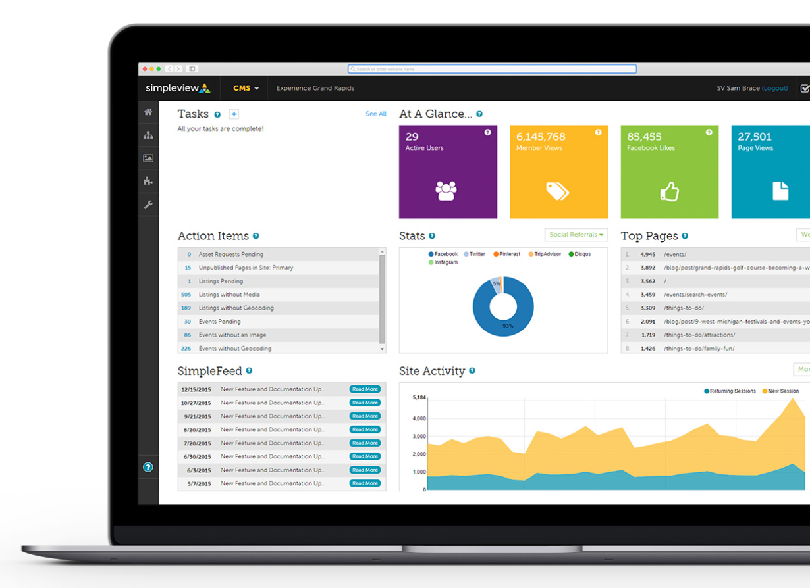

import { Head } from 'mdx-deck'
import { Image } from 'mdx-deck'
import { CodeSurfer } from "mdx-deck-code-surfer"

export { swiss as theme } from 'mdx-deck/themes'

<Head>
  <title>Building a Scalable Component Library</title>
</Head>

import Header1 from './components/Header1'

<Header1>Building a Scalable Component Library</Header1>

---


<p>We build websites... like a lot of websites</p>

---

import Number from './components/Number'

<Number>54</Number>
<small>websites built and launched in 2018</small>

```notes
  That's just over 1 per week.

  Pace = Looking to be more efficient

  No loss in quality
```

---

Simpleview Component Library

---

import Deets from './components/Deets'

<Deets></Deets>

---

import { Appear } from 'mdx-deck'

Goals for our Component Library

<ul>
  <Appear>
    <li>Tightly integrated with our CMS.</li>
    <li>Provide a better experience for our developers.</li>
    <li>Improve code quality and accessibility on our sites.</li>
  </Appear>
</ul>

```notes
  Simple Goals
```

---

import Header2 from './components/Header2'

<Header2>Writing Better Code Made Easy</Header2>

---

*Code examples are **NOT** production ready.*

---

### Links

---

import { Invert } from 'mdx-deck/layouts'

export default Invert

<CodeSurfer
  title="Links are easy!"
  code={require("!raw-loader!./snippets/link-example-basic.html")}
  lang="html"
  showNumbers={false}
  dark={true}
/>

---

But it's missing attributes like:

<ul>
  <Appear>
    <li>target</li>
    <li>rel</li>
    <li>title</li>
  </Appear>
</ul>

---

Components can and should be used to enforce best practices/accessibility.

---

export default Invert

<CodeSurfer
  title="hyperlink component"
  code={require("!raw-loader!./snippets/hyperlink.vue")}
  lang="html"
  showNumbers={false}
  dark={true}
  steps={[
    {},
    { range: [15, 18], notes: "A prop to pass through our link object from the CMS" },
    { range: [20, 33], notes: "Some computed properties to get our attribute values" },
    { range: [2, 9], notes: "We render a simple anchor with all attributes in place" }
  ]}
/>

---

export default Invert

<CodeSurfer
  title="Instead of writing this..."
  code={require("!raw-loader!./snippets/link-example-bad.html")}
  lang="html"
  showNumbers={false}
  dark={true}
/>

---

export default Invert

<CodeSurfer
  title="Devs can write this..."
  code={require("!raw-loader!./snippets/link-example-good.html")}
  lang="html"
  showNumbers={false}
  dark={true}
/>

---

### Images

---

Issues:

<ul>
  <Appear>
    <li>No lazy-loading standard</li>
    <li>Didn't take advantage of picture tag to provide responsive images</li>
  </Appear>
</ul>

---

#### Lazy-loading

---

export default Invert

<CodeSurfer
  title="hyperimage component"
  code={require("!raw-loader!./snippets/hyperimage-lazy-loading.vue")}
  lang="html"
  showNumbers={false}
  dark={true}
  steps={[
    {},
    { range: [13, 24], notes: "On mounted, we setup an Intersection Observer" },
    { range: [17, 20], notes: "If the element is in the viewport, we flip the enteredViewport flag to true." },
    { lines: [2], notes: "When enteredViewport is true, we render the image." }
  ]}
/>

---

#### Responsive Images

---

export default Invert

<CodeSurfer
  title="hyperimage component"
  code={require("!raw-loader!./snippets/hyperimage-responsive.vue")}
  lang="html"
  showNumbers={false}
  dark={true}
  steps={[
    {},
    { range: [3, 6], notes: "We iterate over an array of sizes and set the sources" },
    { notes: "No more double checking MDN for how to use picture" }
  ]}
/>

---

export default Invert

<CodeSurfer
  title="Devs now write this..."
  code={require("!raw-loader!./snippets/image-example-good.html")}
  lang="html"
  showNumbers={false}
  dark={true}
/>

---

Awesome! Super helpful components!

---

But now what?

---

<Header2>A Saas Frontend to match our SaaS Backend</Header2>

---

import { Split } from 'mdx-deck/layouts'

export default Split

<div
  style={{
    padding: '12rem'
  }}
>
  <h3>Simpleview CMS</h3>
  It's a SaaS (Software as a Service) platform!
</div>


---

#### The Focal Point Debacle

---

Focal point enabled the user to select the focus on an image so that cropping applied to the image would center around the focus.

---

Every client got it instantly and it was a totally smooth release...

---

...is what I would like to say

---

It required a very minor **single line update** to enable on the frontend

---

<Appear>
  <span>1 line...&nbsp;</span>
  <span>per widget...&nbsp;</span>
  <span>per client...</span>
</Appear>

---

Roughly a dozen widgets per sites...

---

And a few hundred clients...

---

Never again!

---

The hyperimage component to the rescue!

---

Components in our library live outside of the client site's individual codebase and gets pushed to their sites.

---

Update the component once, and everyone gets it

---

It doesn't stop there!

---

Our component library contains these foundational components, as well as widgets, and apps.

---

Clients can now get regular frontend updates along with regular backend updates.

---

A component library at scale.

---

<Header2>We're Hiring</Header2>
<span>
  <a style={{textDecoration: 'none', color: '#EC407A'}} href='https://www.simpleviewinc.com/our-world/staff/join-our-team/' target='_blank'>Check out the Simpleview Careers page</a>
</span>

---

<Header2>Thank you!</Header2>

Follow me: @arkmuntasser on Twitter and other internet places